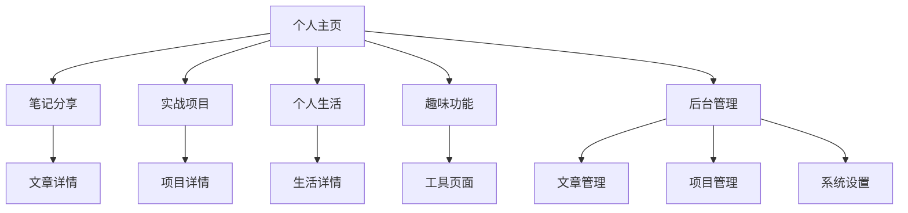

## 1. 产品概述

这是一个面向网络安全专业学生的个人技术博客系统，旨在记录学习历程、分享技术心得、展示项目成果。项目采用现代化的前后端分离架构，前端使用React+TypeScript，后端采用FastAPI，为博主提供完整的内容管理和展示平台。

项目主要解决以下问题：技术知识系统化记录、项目成果展示、学习过程分享、个人品牌建设。目标用户为技术学习者、网络安全爱好者、潜在雇主或合作伙伴。

## 2. 核心功能

### 2.1 用户角色

| 角色 | 注册方式 | 核心权限 |
|------|----------|----------|
| 访客用户 | 无需注册 | 浏览公开内容、评论、点赞 |
| 管理员 | 单用户系统 | 内容管理、系统配置、文件管理 |

### 2.2 功能模块

博客系统包含以下主要页面：
1. **个人主页**：个人介绍、技能展示、联系方式、最新动态
2. **笔记分享**：技术文章列表、文章详情、分类浏览、搜索功能
3. **实战项目**：项目展示、项目详情、技术栈说明、源码链接
4. **个人生活**：生活随笔、照片展示、时间线展示
5. **趣味功能**：恶意文件检测工具、密码生成器、编码解码工具
6. **后台管理**：文章管理、分类管理、文件管理、系统设置

### 2.3 页面详情

| 页面名称 | 模块名称 | 功能描述 |
|----------|----------|----------|
| 个人主页 | 个人信息展示 | 展示头像、昵称、专业背景、技能标签、联系方式 |
| 个人主页 | 最新动态 | 显示最近发布的文章、项目更新、生活动态 |
| 个人主页 | 统计信息 | 文章数量、项目数量、访客统计 |
| 笔记分享 | 文章列表 | 分页展示技术文章，支持按分类和时间筛选 |
| 笔记分享 | 文章详情 | 富文本内容展示、代码高亮、相关文章推荐 |
| 笔记分享 | 分类导航 | 技术分类标签、文章归档 |
| 实战项目 | 项目卡片 | 项目封面、名称、技术栈、项目描述 |
| 实战项目 | 项目详情 | 详细介绍、技术亮点、截图展示、源码链接 |
| 个人生活 | 生活动态 | 图文混排的生活记录、时间线展示 |
| 趣味功能 | 恶意文件检测 | 上传文件检测、病毒特征匹配、检测报告 |
| 趣味功能 | 密码工具 | 密码生成器、强度检测、加密解密 |
| 后台管理 | 文章管理 | 文章CRUD、草稿保存、预览功能 |
| 后台管理 | 分类管理 | 分类CRUD、层级管理 |
| 后台管理 | 文件管理 | 文件上传、恶意文件检测、访问控制 |
| 后台管理 | 系统设置 | 个人信息配置、SEO设置、安全配置 |

## 3. 核心流程

### 访客用户流程
用户访问首页 → 浏览文章/项目/生活内容 → 查看详情 → 互动评论

### 管理员流程
管理员登录 → 进入后台管理 → 内容管理/系统配置 → 发布/编辑内容

## 4. 用户界面设计

### 4.1 设计风格
- **主色调**：深蓝色 (#1e40af) 体现技术专业感
- **辅助色**：浅灰色 (#f3f4f6) 用于背景和卡片
- **强调色**：橙色 (#f59e0b) 用于按钮和重要元素
- **按钮样式**：圆角矩形，悬停动画效果
- **字体**：主要使用 Inter 字体，标题使用加粗样式
- **布局风格**：卡片式布局，响应式网格系统
- **图标风格**：使用 Heroicons 线性图标，保持一致性

### 4.2 页面设计概览

| 页面名称 | 模块名称 | UI元素 |
|----------|----------|--------|
| 个人主页 | 头部区域 | 渐变色背景、圆形头像、大标题、社交图标 |
| 个人主页 | 技能展示 | 标签云形式，悬停放大效果 |
| 笔记分享 | 文章卡片 | 封面图、标题、摘要、标签、发布时间 |
| 文章详情 | 内容区域 | 左侧目录导航，右侧正文，代码块高亮 |
| 实战项目 | 项目网格 | 3列响应式网格，卡片悬停上浮效果 |
| 趣味功能 | 工具卡片 | 图标+标题+简介，点击进入工具页面 |
| 后台管理 | 侧边导航 | 折叠式菜单，图标+文字，当前高亮 |

### 4.3 响应式设计
- **桌面优先**：默认适配1920px宽度
- **平板适配**：768px-1024px，2列布局
- **手机适配**：小于768px，单列布局
- **触摸优化**：按钮最小44px，支持触摸滑动