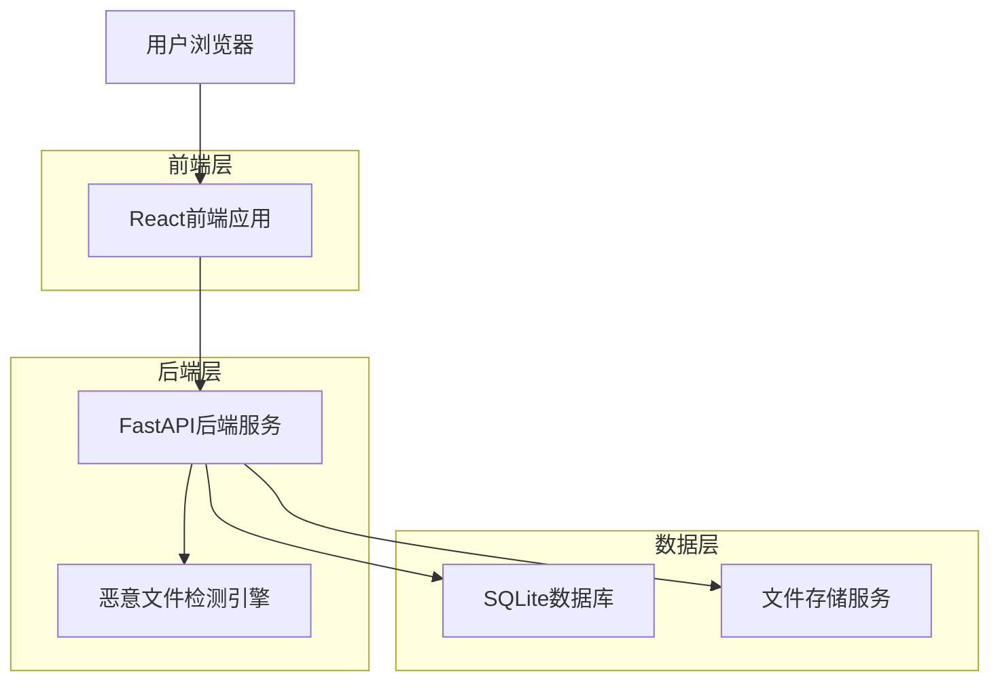
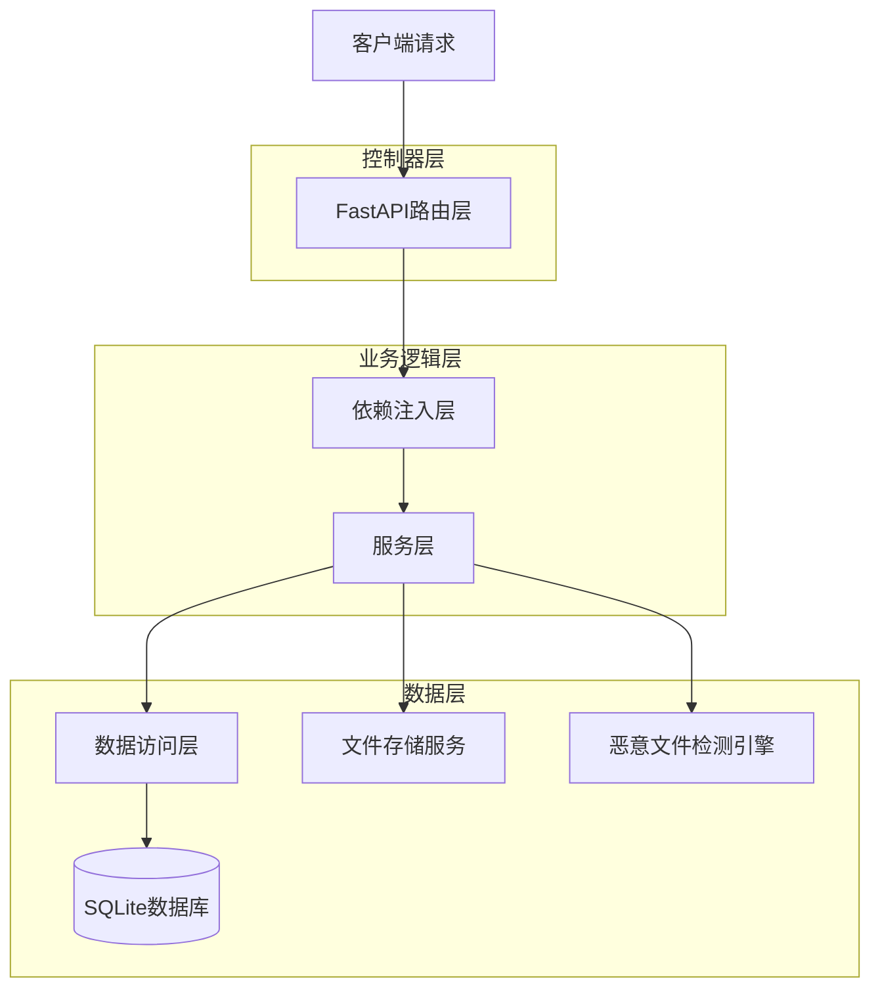
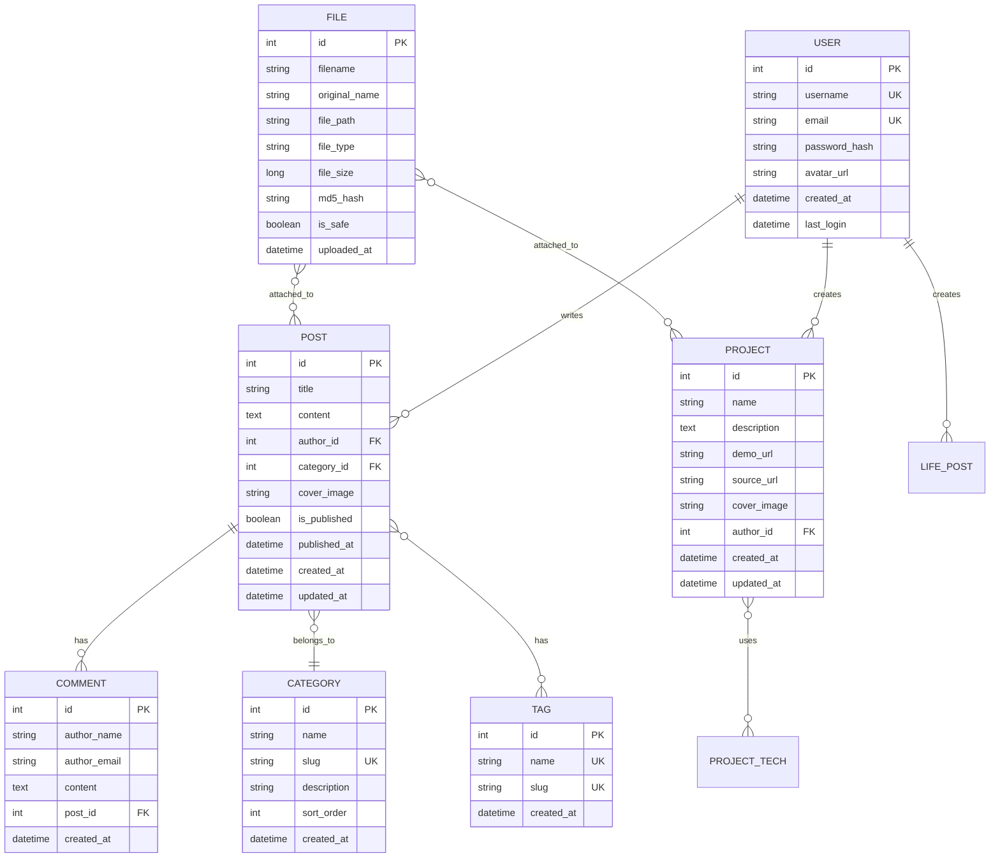

## 1. 架构设计



## 2. 技术描述

- **前端**: React@18 + TypeScript@5 + Vite@5 + Tailwind CSS@3
- **后端**: FastAPI@0.104 + SQLAlchemy@2 + Python@3.11
- **数据库**: SQLite@3 + Alembic@1 数据库迁移
- **认证**: JWT@2 + python-jose@3
- **文件处理**: python-multipart@0.6 + aiofiles@23
- **安全**: bcrypt@4 + python-magic@0.4 (文件类型检测)

## 3. 路由定义

### 前端路由
| 路由 | 用途 |
|------|------|
| / | 个人主页，展示个人信息和最新动态 |
| /notes | 笔记分享页面，技术文章列表 |
| /notes/:id | 文章详情页面 |
| /projects | 实战项目展示页面 |
| /projects/:id | 项目详情页面 |
| /life | 个人生活动态页面 |
| /life/:id | 生活详情页面 |
| /tools | 趣味功能工具列表页面 |
| /tools/file-scan | 恶意文件检测工具 |
| /tools/password | 密码生成器工具 |
| /admin | 后台管理首页 |
| /admin/login | 管理员登录页面 |
| /admin/posts | 文章管理页面 |
| /admin/posts/new | 新建文章页面 |
| /admin/posts/edit/:id | 编辑文章页面 |
| /admin/projects | 项目管理页面 |
| /admin/settings | 系统设置页面 |
| /admin/files | 文件管理页面 |

### 后端API路由
| 路由 | 用途 |
|------|------|
| /api/auth/login | 管理员登录认证 |
| /api/auth/refresh | JWT令牌刷新 |
| /api/posts | 文章CRUD操作 |
| /api/posts/:id | 单篇文章操作 |
| /api/projects | 项目CRUD操作 |
| /api/projects/:id | 单个项目操作 |
| /api/life-posts | 生活动态CRUD操作 |
| /api/life-posts/:id | 单个生活动态操作 |
| /api/categories | 分类管理 |
| /api/files/upload | 文件上传接口 |
| /api/files/scan | 恶意文件检测 |
| /api/tools/password | 密码生成工具 |
| /api/settings | 系统设置管理 |

## 4. API定义

### 4.1 认证相关API

**管理员登录**
```
POST /api/auth/login
```

请求参数：
| 参数名 | 参数类型 | 是否必需 | 描述 |
|--------|----------|----------|------|
| username | string | 是 | 管理员用户名 |
| password | string | 是 | 登录密码 |

响应参数：
| 参数名 | 参数类型 | 描述 |
|--------|----------|------|
| access_token | string | JWT访问令牌 |
| token_type | string | 令牌类型，固定为"bearer" |
| expires_in | integer | 令牌有效期（秒） |

### 4.2 文章管理API

**创建文章**
```
POST /api/posts
```

请求参数：
| 参数名 | 参数类型 | 是否必需 | 描述 |
|--------|----------|----------|------|
| title | string | 是 | 文章标题 |
| content | string | 是 | 文章内容（Markdown） |
| category_id | integer | 是 | 分类ID |
| tags | array | 否 | 标签数组 |
| is_published | boolean | 否 | 是否发布，默认为true |
| cover_image | string | 否 | 封面图片URL |

**获取文章列表**
```
GET /api/posts?page=1&limit=10&category=&tag=
```

查询参数：
| 参数名 | 参数类型 | 描述 |
|--------|----------|------|
| page | integer | 页码，默认为1 |
| limit | integer | 每页数量，默认为10 |
| category | string | 分类筛选 |
| tag | string | 标签筛选 |

## 5. 服务器架构图



## 6. 数据模型

### 6.1 数据模型定义



### 6.2 数据定义语言

**用户表 (users)**
```sql
-- 创建用户表
CREATE TABLE users (
    id INTEGER PRIMARY KEY AUTOINCREMENT,
    username VARCHAR(50) UNIQUE NOT NULL,
    email VARCHAR(100) UNIQUE NOT NULL,
    password_hash VARCHAR(255) NOT NULL,
    avatar_url VARCHAR(255),
    created_at TIMESTAMP DEFAULT CURRENT_TIMESTAMP,
    last_login TIMESTAMP
);

-- 创建索引
CREATE INDEX idx_users_username ON users(username);
CREATE INDEX idx_users_email ON users(email);
```

**文章表 (posts)**
```sql
-- 创建文章表
CREATE TABLE posts (
    id INTEGER PRIMARY KEY AUTOINCREMENT,
    title VARCHAR(200) NOT NULL,
    content TEXT NOT NULL,
    author_id INTEGER NOT NULL,
    category_id INTEGER,
    cover_image VARCHAR(255),
    is_published BOOLEAN DEFAULT 0,
    published_at TIMESTAMP,
    created_at TIMESTAMP DEFAULT CURRENT_TIMESTAMP,
    updated_at TIMESTAMP DEFAULT CURRENT_TIMESTAMP,
    FOREIGN KEY (author_id) REFERENCES users(id) ON DELETE CASCADE,
    FOREIGN KEY (category_id) REFERENCES categories(id) ON DELETE SET NULL
);

-- 创建索引
CREATE INDEX idx_posts_author ON posts(author_id);
CREATE INDEX idx_posts_category ON posts(category_id);
CREATE INDEX idx_posts_published ON posts(is_published, published_at DESC);
```

**项目表 (projects)**
```sql
-- 创建项目表
CREATE TABLE projects (
    id INTEGER PRIMARY KEY AUTOINCREMENT,
    name VARCHAR(100) NOT NULL,
    description TEXT,
    demo_url VARCHAR(255),
    source_url VARCHAR(255),
    cover_image VARCHAR(255),
    author_id INTEGER NOT NULL,
    created_at TIMESTAMP DEFAULT CURRENT_TIMESTAMP,
    updated_at TIMESTAMP DEFAULT CURRENT_TIMESTAMP,
    FOREIGN KEY (author_id) REFERENCES users(id) ON DELETE CASCADE
);

-- 创建索引
CREATE INDEX idx_projects_author ON projects(author_id);
CREATE INDEX idx_projects_created ON projects(created_at DESC);
```

**文件表 (files)**
```sql
-- 创建文件表
CREATE TABLE files (
    id INTEGER PRIMARY KEY AUTOINCREMENT,
    filename VARCHAR(255) NOT NULL,
    original_name VARCHAR(255) NOT NULL,
    file_path VARCHAR(500) NOT NULL,
    file_type VARCHAR(100),
    file_size BIGINT,
    md5_hash VARCHAR(32),
    is_safe BOOLEAN DEFAULT 1,
    uploaded_at TIMESTAMP DEFAULT CURRENT_TIMESTAMP
);

-- 创建索引
CREATE INDEX idx_files_md5 ON files(md5_hash);
CREATE INDEX idx_files_uploaded ON files(uploaded_at DESC);
```